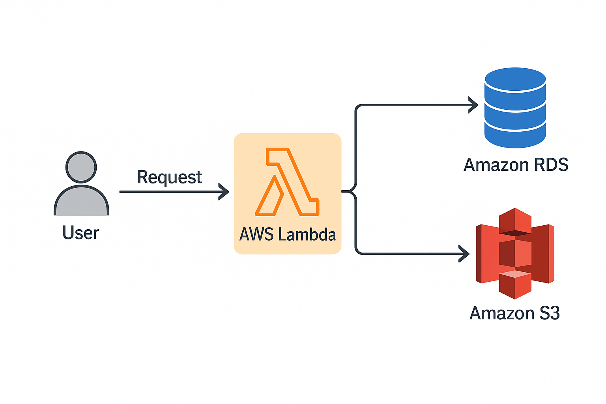

# RELATÓRIO DE IMPLEMENTAÇÃO DE SERVIÇOS AWS

Data: 20/04/2025  
Empresa: Umbrella Corporation   
Responsável: Luís Augusto Coelho de Souza

## Introdução
Este relatório apresenta o processo de implementação de ferramentas na empresa Umbrella Corporation, realizado por Luís Augusto Coelho de Souza. O objetivo do projeto foi elencar 3 serviços AWS, com a finalidade de realizar diminuição de custos imediatos.

## Descrição do Projeto
O projeto de implementação de ferramentas foi dividido em 3 etapas, cada uma com seus objetivos específicos. A seguir, serão descritas as etapas do projeto:

Etapa 1: 
- Amazon Relational Database Service.
- Serviço de banco de dados relacional com foco em facilidade de configuração e mantimento dos dados (backups automatizados).
- Armazenamento de informações sobre estoque, lote, validade dos medicamentos que devem ser mantidos em alta disponibilidade.

Etapa 2: 
- Amazon S3 Intelligent-Tiering.
- Armazenamento de dados com padrões de acesso variáveis sem comprometer a performance.
- Armazenamento de Contratos e Documentos Operacionais, Imagens de Produtos e Relatórios Internos de maneira eficiente e econômica.

Etapa 3: 
- AWS Lambda
- Serviço de Cloud Computing que será responsável por gerenciar o banco de dados e o sistema de armazenamento escolhido em resposta à eventos sem necessidade de gerenciamento de servidores.
- Automação de tarefas como a atualização do estoque, inclusão de novos arquivos de contrato e recebimento de novas encomendas e pedidos.

## Conclusão
A implementação de ferramentas na empresa *Abstergo Industries* tem como esperado a redução dos custos de operação com a implementação da AWS. Com a utilização do Amazon S3 Intelligent-Tiering, espera-se reduzir os custos operacionais ao mover dados automaticamente entre diferentes camadas de armazenamento, baseando-se em seu uso, garantindo um balanceamento eficiente entre acessibilidade e custo, ao mesmo tempo que minimizando a necessidade de manutenção manual e espaço físico de armazenamento.

Além disso, a construção de um banco de dados relacional de alta performance utilizando Amazon RDS permitirá um gerenciamento eficaz e de baixo custo, proporcionando uma plataforma robusta para armazenar e acessar dados com alta disponibilidade e escalabilidade. O Amazon RDS ajudará a suportar as requisições de maneira eficiente, garantindo um desempenho consistente e minimizando o impacto de estresse nos sistemas da empresa, o que é fundamental para manter a agilidade nos processos e a integridade das operações.

Para gerenciar esses processos de maneira automatizada e sem intervenção manual constante, AWS Lambda será utilizado para gerenciar a interação entre o Amazon S3 Intelligent-Tiering e o Amazon RDS. O Lambda executará funções em resposta a eventos de alteração de dados ou necessidades de manutenção, permitindo um fluxo de dados contínuo e sem interrupções, além de otimizar recursos ao executar tarefas sob demanda e apenas quando necessário. Isso garantirá uma arquitetura flexível, escalável e eficiente, com redução de custos e aumento da produtividade. Recomenda-se a continuidade da utilização das ferramentas implementadas e a busca por novas tecnologias que possam melhorar ainda mais os processos da empresa.

## Anexos

Etapa 1 - Implementação do serviço de banco de dados relacional Amazon Relational Database Service

[Documentação Amazon Relational Database Service](https://docs.aws.amazon.com/AmazonRDS/latest/UserGuide/Welcome.html)

Etapa 2 - Implementação do serviço de armazenamento de dados Amazon S3 Intelligent-Tiering:

[Documentação Amazon S3 Intelligent-Tiering](https://docs.aws.amazon.com/AmazonS3/latest/userguide/intelligent-tiering.html)

Etapa 3 - Implementação do serviço de Cloud Computing AWS Lambda para a gestão dos dados do Amazon S3 e RDS

Assinatura do Responsável pelo Projeto:

Luís Augusto Coelho de Souza